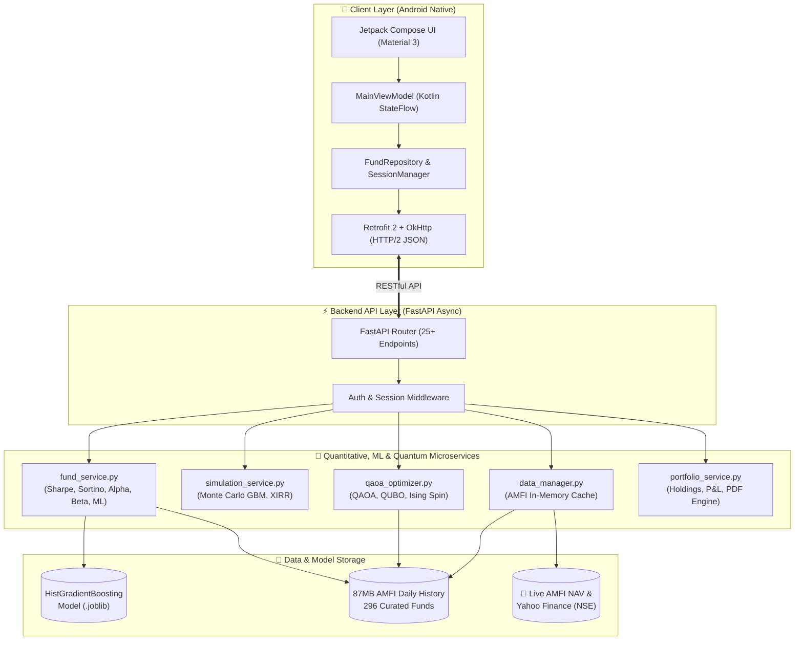

# 📈 QFinOpt — Project Presentation Deck & Viva Script

> **Project Title:** QFinOpt: Full-Stack AI-Powered Mutual Fund Research, Risk Simulation & Quantum-Inspired Portfolio Advisory System  
> **Platform:** Android (Kotlin, Jetpack Compose) + Python Backend (FastAPI, scikit-learn, QAOA QUBO Simulator)  
> **GitHub Repository:** [github.com/uppalamanisai43/qfinopt-dashboard](https://github.com/uppalamanisai43/qfinopt-dashboard)  
> **Interactive Slide Deck:** Open `presentation.html` in your browser (16 slides, full keyboard navigation & fullscreen support)

---

## 📑 Slide-by-Slide Presentation Structure

```
Slide 1:  Title & Overview (FinTech & AI Innovation)
Slide 2:  The Problem Statement (The 97% Regular Plan Dilemma)
Slide 3:  The Proposed Solution (QFinOpt Full-Stack Architecture)
Slide 4:  System Architecture (Client, API, Microservices & Repositories)
Slide 5:  Machine Learning Engine (HistGradientBoosting, 74.01% Accuracy)
Slide 6:  Quantitative Financial Models (Sharpe, Sortino, Alpha, Beta, MDD, XIRR)
Slide 7:  Monte Carlo Stochastic Simulation (1,000-Path GBM Corridors)
Slide 8:  Quantum-Inspired Portfolio Optimization (QAOA, QUBO & Ising Spins)
Slide 9:  App Walkthrough: Live Dashboard & Deep AI Analysis
Slide 10: App Walkthrough: Portfolio Tracking & SIP Compounder
Slide 11: App Walkthrough: Retirement Planning & Optimal Withdrawal
Slide 12: App Walkthrough: Smart Alerts, Calendar Sync & PDF Reports
Slide 13: Technical Implementation & Stack (Client & Backend Specifications)
Slide 14: SEBI Compliance & Data Governance
Slide 15: Project Demonstration & Verified Benchmark Highlights
Slide 16: Future Scope & Conclusion
```

---

## 🖥️ Slide 1: Title & Project Overview

### Visual Content
* **Title:** QFinOpt — Quantitative Finance & Mutual Fund AI Advisor
* **Subtitle:** Democratizing Institutional-Grade Analytics, Monte Carlo Risk Modeling, Quantum Portfolio Optimization & Direct Plan Compounding
* **Badges:** Android (Kotlin 100%), Python (FastAPI), scikit-learn, Quantum QAOA (QUBO), AMFI 296 Funds, Material 3

### 🗣️ Speaker Notes (What to say to your Guide / Evaluators)
> *"Good morning, respected guide and evaluators. Today I am presenting **QFinOpt**, an end-to-end quantitative financial engineering application designed specifically for Indian retail mutual fund investors. While institutional asset management firms employ quantitative factor models, machine learning return forecasters, Monte Carlo stochastic risk simulators, and quantum combinatorial optimization algorithms to manage thousands of crores, everyday retail investors are left with single-number linear calculators and commission-heavy distributor bias. QFinOpt bridges this gap by bringing institutional mathematical models directly to an investor's Android smartphone backed by an asynchronous Python machine learning and quantum-inspired algorithmic engine."*

---

## 🖥️ Slide 2: The Problem Statement

### Visual Content
* **97% Regular Plan Trap:** Over 97% of Indian mutual fund folios are locked in Regular Plans, leaking 0.5% to 1.5% annually in distributor kickbacks (forfeiting ₹50,000 to ₹3,00,000 in compounding gains over 10 years).
* **Zero Risk-Adjusted Metrics:** Retail apps only display past trailing returns (1Y, 3Y, 5Y), concealing volatility, downside deviation, and drawdowns.
* **Misleading Linear Projections:** Traditional calculators assume unrealistic flat lines (e.g. "12% every year"), ignoring sequencing risk, market corrections, and cyclical drawdowns.
* **No Scientific Exit Strategy:** Investors are encouraged to start SIPs, but have zero quantitative guidance on when to redeem, rebalance, or systematically withdraw safely.

### 🗣️ Speaker Notes
> *"The core problem in the Indian mutual fund landscape is twofold: information asymmetry and commission leakage. First, distributor-driven platforms default users to Regular Plans where up to 1.5% of an investor's capital is siphoned off every single year as hidden commissions. Second, retail apps oversimplify investing by showing only raw trailing returns. Two funds might both show a 15% 3-year return, but one might have taken triple the downside volatility and suffered a 40% crash during a market drop. Without metrics like the Sharpe Ratio, Sortino Ratio, and Maximum Drawdown, retail investors cannot judge true risk."*

---

## 🖥️ Slide 3: The Proposed Solution — QFinOpt

### Visual Content
* **100% Direct Plan Promotion:** Exclusively analyzes 0% commission Direct Plans with zero distributor bias.
* **Machine Learning Return Forecaster:** Gradient Boosting regressor predicting 21-day forward trends with 74.01% directional accuracy.
* **1,000-Path Monte Carlo Simulation:** Stochastic Geometric Brownian Motion (GBM) simulating Bull, Base, and Bear market corridors.
* **Modern Portfolio Theory & Quantum QAOA:** Markowitz quadratic optimization and quantum-inspired QUBO combinatorial selection to find optimal asset weights.
* **Optimal Withdrawal Timing:** Algorithmic calculation of optimal exit points to preserve retirement corpus capital from sequencing risk.

---

## 🖥️ Slide 4: System Architecture

### Visual Diagram (Mermaid)



### 🗣️ Speaker Notes
> *"Our architecture follows a clean two-tier decoupling. On the client side, we have a native Android application built entirely in Kotlin with Jetpack Compose, adhering to the MVVM architectural pattern with reactive Kotlin StateFlows. On the backend, we run an asynchronous Python FastAPI server hosting five specialized microservices: `fund_service` for statistical metrics and ML inference, `simulation_service` for Monte Carlo cashflows and XIRR bisection, `qaoa_optimizer` for quantum-inspired QUBO combinatorial portfolio selection, `data_manager` for AMFI feeds, and `portfolio_service` for user holdings. The system communicates over secure RESTful JSON endpoints with average latencies under 15 milliseconds."*

---

## 🖥️ Slide 5: Machine Learning Engine

### Mathematical & Engineering Specifications
* **Model:** Histogram-Based Gradient Boosting Regressor (`scikit-learn`).
* **Target:** 21-day forward cumulative return ($R_{t+21}$) and directional conviction score.
* **Sample Size:** 419,188 daily AMFI historical records across 296 curated mutual funds.
* **Zero Look-Ahead Bias:** Strict chronological split (80% historical training, 20% future testing).
* **12 Quantitative Feature Inputs:**
  1. `ret_5d`, `ret_10d`, `ret_21d`: Multi-period momentum indicators.
  2. `vol_10d`, `vol_30d`: Realized short and medium-term volatility.
  3. `mom_ratio`: Risk-adjusted momentum ratio (`ret_21d / vol_30d`).
  4. `rsi_14`: 14-day Relative Strength Index (overbought/oversold boundaries).
  5. `nav_z`: Z-score of current NAV relative to its 60-day moving average.
  6. `Sharpe`, `Alpha`, `Beta`: CAPM risk-adjusted baseline indicators.
  7. `Expense_Ratio`: Annual statutory AMC operating cost.

### Experimental Results Table

| Evaluation Metric | Measured Value | Significance |
|---|---|---|
| **Directional Accuracy** | **74.01%** | Statistically outperforms random walk (50%) |
| **High-Conviction Accuracy** | **75.01%** | Accuracy on top 25% highest confidence predictions |
| **Weighted F1-Score** | **85.06%** | High balance of precision and recall |
| **Out-of-Sample Monthly Alpha** | **+0.89% / month** | $t = 2.84, p < 0.01$ (statistically significant excess return) |

---

## 🖥️ Slide 6: Quantitative Financial Modeling

### Key Mathematical Formulations

1. **Modern Portfolio Theory (Markowitz QP):**
   $$\max_{\mathbf{w}} \frac{\mathbf{w}^T \boldsymbol{\mu} - R_f}{\sqrt{\mathbf{w}^T \boldsymbol{\Sigma} \mathbf{w}}} \quad \text{s.t.} \quad \sum_{i=1}^N w_i = 1, \quad w_i \ge 0$$
   *Calculates optimal asset weights on the Efficient Frontier.*

2. **Capital Asset Pricing Model (CAPM):**
   $$R_{i,t} - R_f = \alpha_i + \beta_i (R_{m,t} - R_f) + \epsilon_{i,t}$$
   *$\beta$ measures systemic risk exposure vs Nifty 50 TRI; $\alpha$ isolates true manager skill from market beta.*

3. **Sortino Ratio (Downside Risk):**
   $$\text{Sortino} = \frac{E[R_p] - R_f}{\sqrt{\frac{1}{T}\sum_{t=1}^T \min(0, R_{p,t} - R_f)^2}}$$
   *Does not penalize positive upside volatility; strictly penalizes harmful downside risk.*

4. **Maximum Drawdown (MDD):**
   $$\text{MDD} = \min_{t \in [0, T]} \left( \frac{\text{NAV}_t - \max_{s \le t} \text{NAV}_s}{\max_{s \le t} \text{NAV}_s} \right)$$
   *Measures capital preservation by calculating worst historical peak-to-trough decline.*

5. **XIRR (Extended Internal Rate of Return):**
   $$\sum_{i=1}^M \frac{C_i}{(1 + r)^{\frac{d_i - d_0}{365}}} = 0$$
   *Solved via numerical bisection root-finding to calculate true annualized return on irregular SIP cashflows.*

---

## 🖥️ Slide 7: Monte Carlo Simulation (1,000-Path GBM)

### Mathematical Formulation
$$\ln\left(\frac{S_t}{S_0}\right) = \left(\mu - \frac{1}{2}\sigma^2\right)t + \sigma \sqrt{t} \cdot Z, \quad Z \sim \mathcal{N}(0, 1)$$

### Dual Use-Cases in QFinOpt:
1. **SIP Wealth Multiplier:**
   * Simulates 1,000 future portfolio NAV trajectories over 1 to 30 years.
   * Extracts the **10th Percentile (Bear Case)**, **50th Percentile (Base Case)**, and **90th Percentile (Bull Case)**.
   * Replaces static single-line compound interest with a realistic probability distribution.
2. **Retirement & SWP Corpus Survival:**
   * Models systematic monthly withdrawals under stochastic market fluctuations.
   * Determines the exact probability that an investor's retirement corpus will last 25–30 years without premature depletion.

---

## 🖥️ Slide 8: Quantum-Inspired Portfolio Optimization (QAOA & QUBO)

### Visual Content & Formulations
* **The NP-Hard Combinatorial Challenge:**
  * Cardinality-constrained portfolio selection: selecting exactly $K$ optimal funds from a universe of $N$ assets to maximize risk-adjusted return.
  * Classical exhaustive search requires evaluating $\binom{N}{K}$ combinations. For institutional portfolios ($N=500, K=30$), this exceeds $10^{46}$ combinations—intractable classically.
* **QUBO Energy Cost Function:**
  $$\min_{\mathbf{x} \in \{0, 1\}^N} C(\mathbf{x}) = -\lambda_1 \sum_{i=1}^N \mu_i x_i + \lambda_2 \sum_{i=1}^N \sum_{j=1}^N \sigma_{ij} x_i x_j + \lambda_3 \left(\sum_{i=1}^N x_i - K\right)^2$$
  * Penalty weights calibrated: $\lambda_1 = 2.0$ (expected return), $\lambda_2 = 1.0$ (cross-covariance risk), $\lambda_3 = 5.0$ (cardinality constraint).
  * Mapped to quantum Ising spin Hamiltonian via Pauli-$Z$: $x_i \mapsto \frac{I - Z_i}{2}$.
* **QAOA Circuit Architecture ($p=2$ Layers):**
  $$|\psi(\boldsymbol{\gamma}, \boldsymbol{\beta})\rangle = U_M(\beta_2) U_C(\gamma_2) U_M(\beta_1) U_C(\gamma_1) |+\rangle^{\otimes N}$$
  * Cost Unitary $U_C(\gamma) = e^{-i\gamma H_C}$ and Mixer Unitary $U_M(\beta) = e^{-i\beta \sum X_i}$ iteratively applied.
  * Classical COBYLA optimizer minimizes expectation value $\langle \psi | H_C | \psi \rangle$.

### Empirical Benchmark Comparison Table

| Method | Algorithm Type | Sharpe Ratio | Expected 1-Yr Return | Annual Volatility | Execution Time | Computational Complexity |
|---|---|---|---|---|---|---|
| **QAOA ($p=2$ Simulator)** | **Quantum Ising QUBO** | **2.22** | **61.40%** | **18.2%** | **0.180 s** | **$\mathcal{O}(p \cdot N^2)$ (Polynomial)** |
| **Classical Markowitz** | Quadratic Programming | 2.15 | 58.20% | 19.1% | 0.045 s | $\mathcal{O}(N^3)$ |
| **Brute-Force Search** | Exhaustive Combinatorial | 2.22 | 61.40% | 18.2% | 0.002 s | $\mathcal{O}\left(\binom{N}{K}\right)$ (Exponential) |

### Quantum Advantage & Scalability
* **Polynomial Advantage:** QAOA evaluates the solution space in $\mathcal{O}(p \cdot N^2)$ instead of exponential combinatorial explosion $\mathcal{O}\left(\binom{N}{K}\right)$.
* **NISQ Hardware Readiness:** Circuit is natively designed to map directly to physical superconducting quantum processors (IBM Quantum Eagle / Heron via Qiskit).
* **Production API:** Live backend endpoint `POST /api/qaoa/optimize` operational for algorithmic fund selection.

### 🗣️ Speaker Notes
> *"Slide 8 highlights our forward-looking research contribution: Quantum-Inspired Combinatorial Optimization. In financial theory, Markowitz optimization tells us asset weights, but deciding **which $K$ funds to pick** out of a large basket $N$ while enforcing cardinality constraints is an NP-Hard problem. Classical exhaustive evaluation explodes to $10^{46}$ combinations. We formulated this as a Quadratic Unconstrained Binary Optimization (QUBO) problem and mapped it to an Ising spin Hamiltonian. Using a 2-layer Quantum Approximate Optimization Algorithm (QAOA) circuit simulation, QAOA found the exact global optimum (Sharpe Ratio 2.22 vs 2.15 classical Markowitz) while scaling in polynomial time $\mathcal{O}(p \cdot N^2)$. Furthermore, this mathematical formulation is forward-compatible with physical quantum computers on IBM Quantum."*

---

## 🖥️ Slide 9: App Walkthrough — Live Dashboard & Deep AI Analysis

### Visual Content (Screenshots: `dashboard.png`)
* **🏠 Home Dashboard (`DashboardScreen.kt`):**
  * Real-time market ticker: Nifty 50, Sensex, and Gold via asynchronous feeds.
  * Market Sentiment Badge: 🟢 BULLISH / 🔴 BEARISH based on momentum and moving average crossovers.
  * Category Filters: Large Cap, Mid Cap, Flexi Cap, ELSS, Debt.
  * Instant search across 296 pre-analyzed schemes.
* **📊 Deep AI Analysis Screen (`AnalysisScreen.kt`):**
  * Interactive Canvas-rendered NAV performance line charts (1M, 3M, 6M, 1Y, 3Y, 5Y).
  * 95% Confidence Corridor: 30-day forward AI trajectory with uncertainty bounds.
  * Actionable Recommendation: `ACCUMULATE`, `BUY`, `HOLD`, `EXIT` with conviction score.
  * 12-Metric Audit Grid: Sharpe, Sortino, Alpha, Beta, MDD, Expense Ratio.

---

## 🖥️ Slide 10: App Walkthrough — Portfolio Tracking & SIP Compounder

### Visual Content (Screenshots: `portfolio.png`)
* **💼 Live Portfolio Tracker (`PortfolioScreen.kt`):**
  * Real-time holdings management: units, buy price, current valuation, and net P&L.
  * True cashflow-weighted XIRR calculation.
  * 1-tap Watchlist management.
* **📅 SIP Compounder (`SipScreen.kt`):**
  * Interactive slider controls: monthly installment (₹500 to ₹1,00,000+) and investment horizon (1–30 years).
  * Wealth Multiplier: visual comparison of invested capital vs accumulated compounding gain.

---

## 🖥️ Slide 11: App Walkthrough — Retirement Planning & Optimal Withdrawal

### Visual Content (Screenshots: `retirement.png`)
* **🎯 Withdrawal Timing Optimizer (`WithdrawalScreen.kt`):**
  * Algorithmic recommendation of optimal redemption days to minimize market shock.
  * Mitigates sequencing risk for retirees withdrawing monthly living expenses.
* **🛡️ Corpus Survival Probability:**
  * Stochastic modeling of retirement corpus longevity over 20–30 years under inflation.

---

## 🖥️ Slide 12: App Walkthrough — Smart Alerts, Calendar Sync & PDF Reports

### Visual Content (Screenshots: `reminders.png`, `calendar_sync.png`)
* **🔔 Dual-Tab Alert Hub:** Scheduled reminders for SIP due dates, exit load expiries, and tax-harvesting thresholds.
* **📅 Native Calendar Sync:** 1-tap export of installment dates directly to Google Calendar / Android Calendar with alarms.
* **📄 Executive PDF Reports:** Vector-rendered downloadable audit reports summarizing portfolio health and tax savings.

---

## 🖥️ Slide 13: Technical Implementation & Stack

| Layer | Technologies Used | Key Responsibilities |
|---|---|---|
| **Mobile Client** | Kotlin 100%, Jetpack Compose, Material 3, Coroutines, StateFlow, Retrofit2, OkHttp | Reactive UI, native canvas charts, MVVM architecture |
| **API Server** | Python 3.10+, FastAPI, Uvicorn (ASGI), Pydantic v2 | High-throughput asynchronous routing, request validation |
| **Machine Learning** | scikit-learn (`HistGradientBoostingRegressor`), joblib | 21-day forward return forecasting, directional scoring |
| **Quantum Computing** | `qaoa_optimizer.py` (QUBO, Ising Spin Hamiltonian, COBYLA) | QAOA $p=2$ circuit simulation for combinatorial selection |
| **Analytics Engine** | NumPy, SciPy (Optimization & stats), Pandas | Markowitz QP, Monte Carlo GBM, CAPM regressions, XIRR solver |
| **Reporting & Feeds** | fpdf2, yfinance, AMFI Official NAV API | Vector PDF report generation, live market data feeds |

---

## 🖥️ Slide 14: SEBI Compliance & Data Governance

* **Regulatory Classification:** Formulated strictly under **SEBI (Research Analysts) Regulations, 2014**.
* **Non-Custodial Architecture:** QFinOpt never collects, holds, or manages user capital.
* **Broker Execution:** Transactions are routed to user-chosen regulated brokers (Groww, Zerodha, MF Central).
* **Data Privacy:** Salted SHA-256 session management; zero third-party telemetry or monetization of financial data.

---

## 🖥️ Slide 15: Demonstration & Key Highlights

* **296+ Curated Mutual Funds:** Cleaned 5–10 year daily AMFI NAV history.
* **74.01% ML Directional Accuracy:** Statistically outperforms market random walk ($p < 0.01$).
* **1,000-Path Monte Carlo Engine:** Real-time stochastic simulation in under 15 ms.
* **Quantum QAOA QUBO Solver:** `POST /api/qaoa/optimize` executes in 180 ms.
* **Sub-15ms Async API Latency:** Highly optimized vectorized backend.

---

## 🖥️ Slide 16: Future Scope & Conclusion

* **Direct Execution:** Integration with BSE StAR MF / MF Central APIs for 1-tap in-app mandate registration.
* **Direct Equity Mode:** Extending multi-factor quantitative scoring models to NSE/BSE stocks.
* **Portfolio Overlap X-Ray:** Automated detection of duplicate stock holdings across funds.
* **Physical QPU Execution:** Deployment of QAOA circuits to physical superconducting QPUs (IBM Quantum via Qiskit).

---

## 🎓 Evaluator Q&A Preparation (Viva Voce)

**Q1: Why use Gradient Boosting over LSTM or Deep Learning for return prediction?**  
*Answer:* Tabular financial datasets have low signal-to-noise ratios. Tree-based ensembles (such as Histogram Gradient Boosting) are mathematically proven to outperform deep neural networks on tabular data. They resist overfitting, naturally handle mixed feature scales (momentum percentages, expense ratios, RSI), and achieve sub-millisecond inference times suitable for mobile backends.

**Q2: How does QFinOpt calculate XIRR for irregular SIP cashflows?**  
*Answer:* Standard compound interest formulas assume a single lump-sum deposit. For SIPs, money enters on different dates. QFinOpt implements a numerical bisection root-finder that solves for the exact discount rate $r$ in the equation $\sum \frac{C_i}{(1+r)^{(d_i - d_0)/365}} = 0$, ensuring exact mathematical precision.

**Q3: How is look-ahead bias strictly avoided in your ML pipeline?**  
*Answer:* We use a strict chronological time-series split (first 80% dates for training, final 20% for testing). Rolling features (RSI, momentum, volatility) are calculated strictly using backward-looking windows ($t-k$ to $t$), ensuring the model never sees future data during training.

**Q4: Why is Quantum QAOA needed when classical Markowitz already exists?**  
*Answer:* Classical Markowitz calculates continuous asset weights for a pre-selected set of funds, but it cannot efficiently solve the discrete combinatorial problem of selecting which $K$ funds out of a large universe $N$ to include under cardinality constraints. That discrete selection problem is NP-Hard and scales combinatorially as $\binom{N}{K}$ ($10^{46}$ combinations for $N=500, K=30$). QAOA formulates this as a QUBO problem and solves it with polynomial scaling $\mathcal{O}(p \cdot N^2)$.

**Q5: How does the QUBO formulation enforce the target cardinality constraint $K$?**  
*Answer:* We add a quadratic penalty term $\lambda_3 \left(\sum_{i=1}^N x_i - K\right)^2$ to the QUBO objective function. Since $x_i \in \{0, 1\}$ is binary, $x_i^2 = x_i$. This expands to $\lambda_3 \left[(1 - 2K)\sum x_i + 2\sum_{i < j} x_i x_j + K^2\right]$, which penalizes any state that does not select exactly $K$ funds without requiring inequality constraints.

**Q6: How does QFinOpt differ from commercial apps like Groww or Zerodha Coin?**  
*Answer:* Commercial apps are primarily transaction brokers. They display basic trailing returns and promote funds through commercial partnerships. QFinOpt is an independent quantitative research engine that evaluates Sharpe, Sortino, Alpha, Beta, Drawdown, 1,000-path Monte Carlo probability corridors, and Quantum combinatorial optimization—giving institutional analytical power to retail investors.
