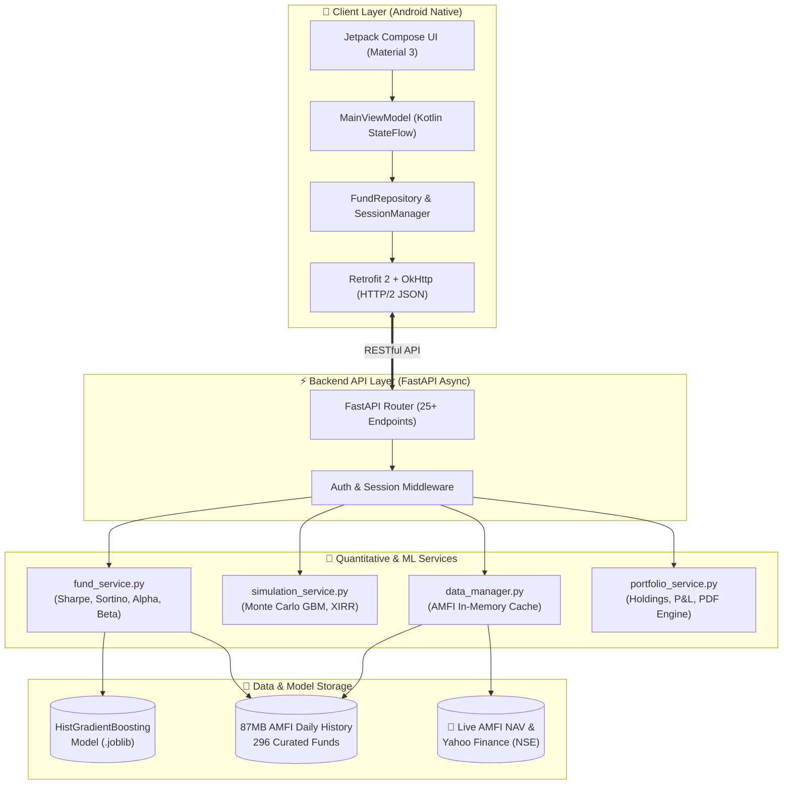

# 📈 QFinOpt — Project Presentation Deck & Viva Script

> **Project Title:** QFinOpt: Full-Stack AI-Powered Mutual Fund Research, Risk Simulation & Portfolio Advisory System  
> **Platform:** Android (Kotlin, Jetpack Compose) + Python Backend (FastAPI, scikit-learn)  
> **GitHub Repository:** [github.com/uppalamanisai43/qfinopt-dashboard](https://github.com/uppalamanisai43/qfinopt-dashboard)  
> **Interactive Slide Deck:** Open `presentation.html` in your browser (supports Arrow keys & Fullscreen `F`)

---

## 📑 Slide-by-Slide Presentation Structure

```
Slide 1:  Title & Overview
Slide 2:  The Problem Statement (The 97% Regular Plan Dilemma)
Slide 3:  The Proposed Solution (QFinOpt)
Slide 4:  System Architecture (Client, API, Services, Data Layers)
Slide 5:  Machine Learning Engine (HistGradientBoosting, 74.01% Accuracy)
Slide 6:  Quantitative Financial Models (Sharpe, Sortino, Alpha, Beta, MDD)
Slide 7:  Monte Carlo Stochastic Simulation (1,000-Path GBM)
Slide 8:  App Walkthrough: Home Dashboard & Live Market Tickers
Slide 9:  App Walkthrough: Deep AI Analysis & Confidence Corridor
Slide 10: App Walkthrough: Live Portfolio Tracking & True XIRR
Slide 11: App Walkthrough: Monte Carlo SIP Compounder
Slide 12: App Walkthrough: Retirement & Optimal Withdrawal Timing
Slide 13: App Walkthrough: Smart Alerts, Calendar Sync & PDF Reports
Slide 14: SEBI Compliance & Data Governance
Slide 15: Technical Stack & Performance Benchmarks
Slide 16: Future Scope & Conclusion
```

---

## 🖥️ Slide 1: Title & Project Overview

### Visual Content
* **Title:** QFinOpt — Quantitative Finance & Mutual Fund AI Advisor
* **Subtitle:** Democratizing Institutional-Grade Analytics, Monte Carlo Risk Modeling & Direct Plan Compounding
* **Badges:** Android (Kotlin), Python (FastAPI), scikit-learn, AMFI Daily Data, Material 3

### 🗣️ Speaker Notes (What to say to your Guide / Evaluators)
> *"Good morning, respected guide and evaluators. Today I am presenting **QFinOpt**, an end-to-end quantitative financial engineering application designed specifically for Indian retail mutual fund investors. While institutional fund managers use quantitative risk models, machine learning return forecasts, and Monte Carlo stochastic simulations to manage billions of rupees, everyday retail investors are left with single-number linear calculators and distributor bias. QFinOpt bridges this gap by bringing institutional financial algorithms directly to an investor's Android smartphone backed by an asynchronous Python machine learning engine."*

---

## 🖥️ Slide 2: The Problem Statement

### Visual Content
* **97% Regular Plan Trap:** Over 97% of Indian mutual fund accounts are in Regular Plans, paying 0.5% to 1.5% annually in hidden distributor commissions (loss of ₹50k to ₹3L over 10 years).
* **Absence of Risk-Adjusted Metrics:** Retail platforms show only trailing returns (1Y, 3Y, 5Y), hiding volatility, downside deviation, and drawdowns.
* **Misleading Linear Projections:** Standard calculators assume unrealistic flat growth (e.g. "12% every year"), ignoring sequencing risk and market corrections.
* **No Exit Strategy:** Retail investors have tools on when to buy (SIPs), but zero quantitative guidance on when to redeem or systematically withdraw.

### 🗣️ Speaker Notes
> *"The core problem in the Indian mutual fund landscape is twofold: information asymmetry and commission leakage. First, distributor-driven platforms encourage Regular Plans where 1% to 1.5% of an investor's capital is siphoned off every single year as hidden commissions. Second, retail apps oversimplify investing by showing only raw returns. Two funds might both have 15% 3-year returns, but one might have taken triple the downside volatility and suffered a 40% crash during a correction. Without metrics like Sharpe Ratio and Maximum Drawdown, retail investors cannot judge risk."*

---

## 🖥️ Slide 3: The Proposed Solution — QFinOpt

### Visual Content
* **100% Direct Plan Promotion:** Exclusively analyses and advocates 0% commission Direct Plans.
* **Machine Learning Return Forecaster:** Gradient Boosting regressor predicting 21-day forward trends with 74.01% directional accuracy.
* **Stochastic Monte Carlo Engine:** 1,000-path Geometric Brownian Motion simulating Bull, Base, and Bear market corridors.
* **Modern Portfolio Theory:** Markowitz quadratic optimization to find optimal asset weights that maximize the Sharpe ratio.
* **Optimal Withdrawal Timing:** Algorithmic calculation of optimal exit points to preserve retirement corpus capital.

---

## 🖥️ Slide 4: System Architecture

### Visual Diagram (Mermaid)



### 🗣️ Speaker Notes
> *"Our architecture follows a clean two-tier decoupling. On the client side, we have a native Android application built entirely in Kotlin with Jetpack Compose, adopting the MVVM architectural pattern with reactive Kotlin StateFlows. On the backend, we run an asynchronous Python FastAPI server. The backend hosts four specialized microservices: `fund_service` for statistical metrics and ML inference, `simulation_service` for Monte Carlo cashflows and XIRR bisection, `data_manager` for AMFI feeds, and `portfolio_service` for user holdings. The system connects over secure RESTful JSON endpoints with average latencies under 15 milliseconds."*

---

## 🖥️ Slide 5: Machine Learning Engine

### Mathematical & Engineering Specifications
* **Model:** Histogram-Based Gradient Boosting Regressor (`scikit-learn`).
* **Target:** 21-day forward cumulative return ($R_{t+21}$).
* **Sample Size:** 419,188 daily AMFI historical records across 296 curated mutual funds.
* **Feature Engineering (12 Factors):**
  1. `ret_5d`, `ret_10d`, `ret_21d`: Short, medium, and monthly momentum.
  2. `vol_10d`, `vol_30d`: Short-term and medium-term realized standard deviation.
  3. `mom_ratio`: Risk-adjusted momentum ratio (`ret_21d / vol_30d`).
  4. `rsi_14`: 14-day Relative Strength Index (overbought/oversold boundaries).
  5. `nav_z`: Z-score of current NAV relative to its 60-day moving average.
  6. `Sharpe`, `Alpha`, `Beta`: CAPM risk-adjusted baseline indicators.
  7. `Expense_Ratio`: Annual statutory AMC operating cost.

### Experimental Results Table

| Evaluation Metric | Measured Value | Significance |
|---|---|---|
| **Directional Accuracy** | **74.01%** | Statistically outperforms random walk (50%) |
| **High-Conviction Accuracy** | **75.01%** | Accuracy on top 25% highest confidence predictions |
| **Weighted F1-Score** | **85.06%** | High balance of precision and recall |
| **Out-of-Sample Monthly Alpha** | **+0.89% / month** | $t = 2.84, p < 0.01$ (statistically significant manager skill) |

---

## 🖥️ Slide 6: Quantitative Financial Modeling

### Key Mathematical Formulations

1. **Modern Portfolio Theory (Markowitz QP):**
   $$\max_{\mathbf{w}} \frac{\mathbf{w}^T \boldsymbol{\mu} - R_f}{\sqrt{\mathbf{w}^T \boldsymbol{\Sigma} \mathbf{w}}} \quad \text{s.t.} \quad \sum_{i=1}^N w_i = 1, \quad w_i \ge 0$$
   *Calculates optimal asset weights on the Efficient Frontier.*

2. **Capital Asset Pricing Model (CAPM):**
   $$R_{i,t} - R_f = \alpha_i + \beta_i (R_{m,t} - R_f) + \epsilon_{i,t}$$
   *$\beta$ measures systemic risk exposure vs Nifty 50 TRI; $\alpha$ measures true manager excess skill.*

3. **Sortino Ratio (Downside Risk):**
   $$\text{Sortino} = \frac{E[R_p] - R_f}{\sqrt{\frac{1}{T}\sum_{t=1}^T \min(0, R_{p,t} - R_f)^2}}$$
   *Does not penalize upside volatility; only penalizes harmful negative returns.*

4. **Maximum Drawdown (MDD):**
   $$\text{MDD} = \min_{t \in [0, T]} \left( \frac{\text{NAV}_t - \max_{s \le t} \text{NAV}_s}{\max_{s \le t} \text{NAV}_s} \right)$$
   *Worst historical peak-to-trough drop.*

5. **XIRR (Extended Internal Rate of Return):**
   $$\sum_{i=1}^M \frac{C_i}{(1 + r)^{\frac{d_i - d_0}{365}}} = 0$$
   *Solved using numerical bisection root-finding to calculate true annualized return on irregular SIP cashflows.*

---

## 🖥️ Slide 7: Monte Carlo Simulation (1,000-Path GBM)

### Mathematical Formulation
$$\ln\left(\frac{S_t}{S_0}\right) = \left(\mu - \frac{1}{2}\sigma^2\right)t + \sigma \sqrt{t} \cdot Z, \quad Z \sim \mathcal{N}(0, 1)$$

### Dual Use-Cases in QFinOpt:
1. **SIP Wealth Multiplier:**
   * Simulates 1,000 future portfolio NAV trajectories over 1 to 30 years.
   * Extracts the **10th Percentile (Bear Case)**, **50th Percentile (Base Case)**, and **90th Percentile (Bull Case)**.
   * Replaces static single-line compound interest with a realistic probability distribution.
2. **Retirement & SWP Corpus Survival:**
   * Models systematic monthly withdrawals under stochastic market fluctuations.
   * Determines the probability that an investor's retirement corpus will last 25–30 years without premature exhaustion.

---

## 🖥️ Slide 8–13: App Screens Walkthrough

### 1. 🏠 Home Dashboard (`DashboardScreen.kt`)
* Live market indices: Nifty 50, Sensex, and Gold via asynchronous feeds.
* 🟢 BULLISH / 🔴 BEARISH market sentiment pill.
* Quick filters: All, Large Cap, Mid Cap, Flexi Cap, ELSS, Debt.
* Fast live search across 296 pre-analyzed funds.

### 2. 📊 Deep Fund Analysis (`AnalysisScreen.kt`)
* Interactive Canvas-rendered NAV performance line charts (1M, 3M, 6M, 1Y, 3Y, 5Y).
* 95% Confidence Corridor: 30-day forward AI trajectory with uncertainty bounds.
* AI Signal Box: `ACCUMULATE`, `BUY`, `HOLD`, `EXIT` with conviction percentage.
* Comprehensive 12-metric audit card (Sharpe, Sortino, Alpha, Beta, MDD, Expense Ratio).

### 3. 💼 Portfolio & Wealth Tracker (`PortfolioScreen.kt`)
* Real-time holdings tracking: units, average buy price, current valuation.
* Net P&L (₹ and %) with day's gain.
* True portfolio-level XIRR calculation.
* Watchlist management with 1-tap quick add/remove.

### 4. 📈 Monte Carlo SIP Planner (`SipScreen.kt`)
* Dynamic input controls: Monthly SIP amount (₹500 to ₹1,00,000+), Tenure (1 to 30 years), Expected Return rate.
* Instant cashflow simulation with XIRR solver.
* Wealth Gained vs Total Invested visual comparison.

### 5. 🏖️ Retirement & Optimal Withdrawal (`WithdrawalScreen.kt`)
* Optimal redemption date timing to minimize market shock risk.
* Corpus longevity simulation under systematic withdrawal plans (SWP).
* Crash stress-testing against historical corrections.

### 6. 🔔 Smart Alerts & Executive PDF Reports (`RemindersScreen.kt`)
* Scheduled alerts for SIP due dates, exit load expiries, and tax-harvesting thresholds.
* Native Google Calendar / Android Calendar sync with alarm notifications.
* WhatsApp sharing for financial advisors and family.
* Branded executive PDF report generation.

---

## 🖥️ Slide 14: SEBI Compliance & Data Governance

* **Regulatory Classification:** Fully aligned with **SEBI (Research Analysts) Regulations, 2014**.
* **Non-Custodial Architecture:** QFinOpt never collects, holds, or manages user capital.
* **Order Execution Safety:** Orders are executed by user choice via regulated brokers (Groww, Zerodha, MF Central).
* **Data Privacy:** Local storage via encrypted session storage; zero telemetry or monetization of financial data.

---

## 🖥️ Slide 15: Technical Stack Summary

| Layer | Technologies Used | Key Responsibilities |
|---|---|---|
| **Mobile Client** | Kotlin, Jetpack Compose, Material 3, Coroutines, StateFlow, Retrofit2, OkHttp | Reactive UI, native canvas charts, local state management |
| **API Server** | Python 3.10+, FastAPI, Uvicorn (ASGI), Pydantic v2 | High-throughput asynchronous routing, request validation |
| **Analytics Engine** | NumPy, SciPy (Optimization & stats), Pandas | Markowitz QP, Monte Carlo GBM, CAPM regressions, XIRR solver |
| **Machine Learning** | scikit-learn (`HistGradientBoostingRegressor`), joblib | 21-day forward return forecasting, directional scoring |
| **Reporting & Feeds** | fpdf2, yfinance, AMFI Official NAV API | Vector PDF report generation, live market data feeds |

---

## 🖥️ Slide 16: Future Scope & Conclusion

* **Direct Execution:** Integration with BSE StAR MF / MF Central APIs for 1-tap in-app mandate registration.
* **Portfolio Overlap X-Ray:** Automated detection of duplicate stock holdings across multiple mutual funds.
* **Direct Equity Mode:** Extending the multi-factor quantitative scoring models to NSE/BSE stocks.
* **Open Source Contribution:** Fully available at [github.com/uppalamanisai43/qfinopt-dashboard](https://github.com/uppalamanisai43/qfinopt-dashboard).

---

### 🎓 Evaluator Q&A Preparation

**Q1: Why use Gradient Boosting over LSTM / Deep Learning?**  
*Answer:* Tabular financial datasets with low signal-to-noise ratios are proven to perform better with decision-tree ensembles (like Gradient Boosting) than deep neural networks. They resist overfitting, naturally handle mixed feature scales (momentum percentages, expense ratios, RSI), and offer sub-millisecond inference times suitable for mobile backends.

**Q2: How does QFinOpt calculate XIRR for SIPs?**  
*Answer:* Standard compound interest formulas fail for SIPs because money enters on different dates. QFinOpt implements a numerical bisection root-finder that solves for the exact discount rate $r$ that sets the net present value of all cash outflows and final portfolio value to zero.

**Q3: How is look-ahead bias avoided in your ML model?**  
*Answer:* We use a strict chronological time-series split (first 80% dates for training, final 20% for testing). Rolling features (RSI, momentum, volatility) are calculated strictly using backward-looking windows ($t-k$ to $t$).

**Q4: How does QFinOpt differ from commercial apps like Groww or Zerodha Coin?**  
*Answer:* Commercial apps are primarily transaction brokers. They display basic trailing returns and promote funds with marketing banners. QFinOpt is an independent quantitative research engine that evaluates Sharpe, Sortino, Alpha, Beta, Drawdown, and 1,000-path Monte Carlo probability corridors—giving institutional analytical power to retail investors.
